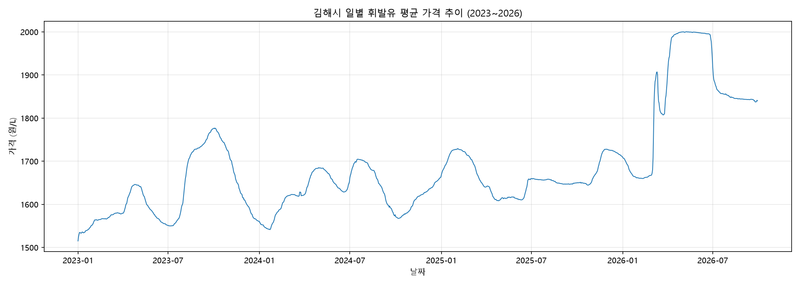
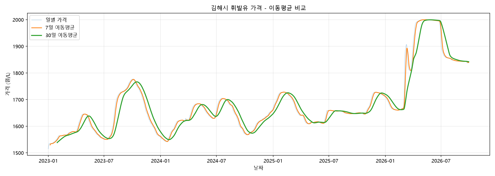
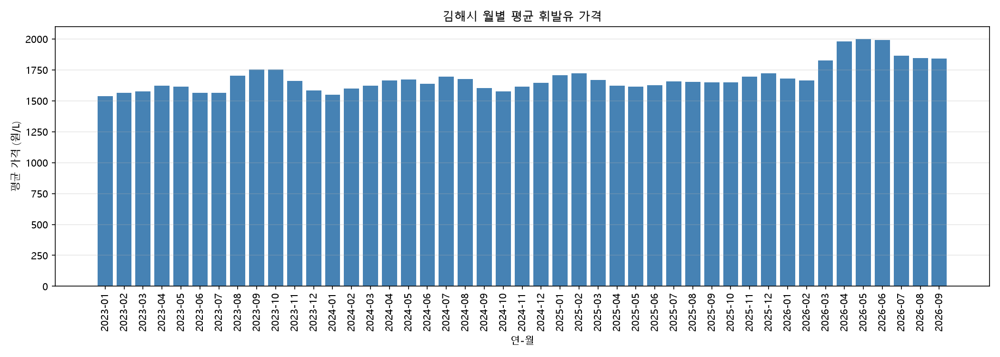
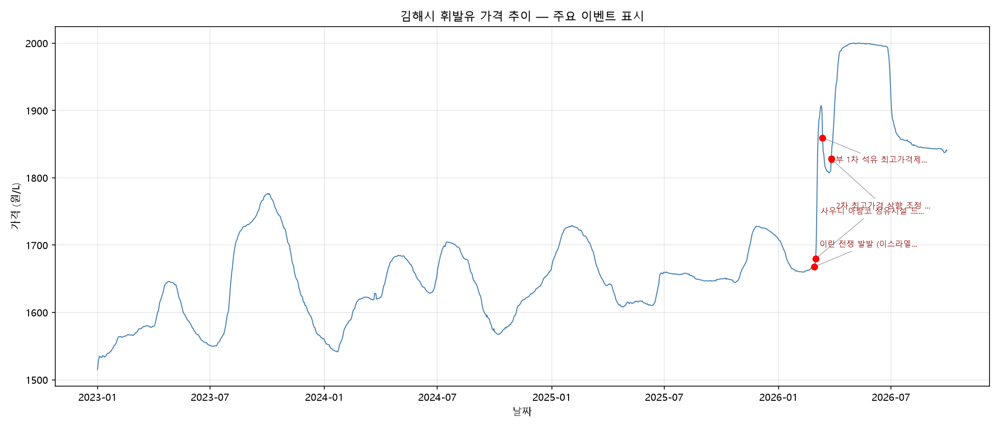
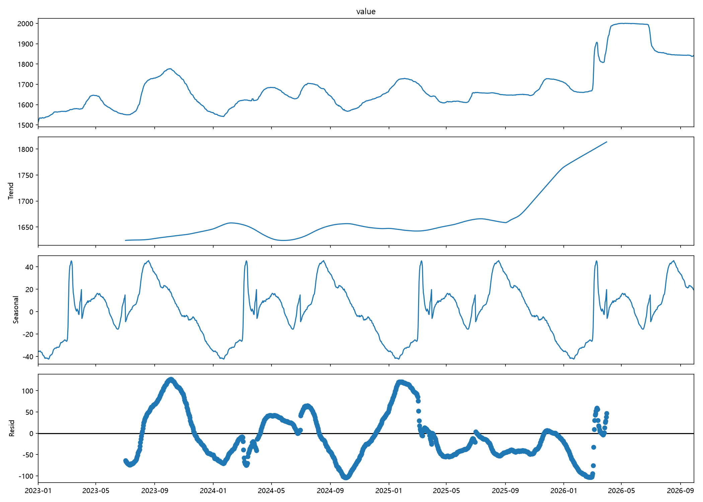

# 김해시 휘발유 가격 트렌드 분석 리포트

## 1. 분석 주제 및 선정 이유

전국 유가는 많이 다뤄지는 주제이지만, 특정 지역(김해시) 단위의 일별 휘발유 가격 데이터를 활용하면
지역 소비자 관점에서 "언제 주유하는 것이 유리한가"를 실제로 분석할 수 있다.
또한 2026년 초 국제 정세 변화(중동 정세 불안)로 유가가 급등한 시기를 포함하고 있어,
외부 이벤트가 가격에 미치는 영향을 구체적으로 확인해볼 수 있다는 점에서 이 주제를 선정했다.

## 2. 분석 질문 (3개 이상)

1. 2023–2026년 전반적으로 가격은 어떤 흐름(패턴)을 보였는가? 계절적 등락이 존재하는가?
2. 2026년 3월의 급등은 어떤 외부 이벤트와 연결되는가?
3. 정부의 가격 통제 정책(최고가격제) 도입 전후로 가격 변동 패턴이 달라졌는가?

## 3. 데이터 설명

- **출처**: 한국석유공사 오피넷(Opinet) "유가내려받기" 서비스 (사업자별 과거 판매가격, 2008.4.15– 제공)
  - URL: https://www.opinet.co.kr
  - 수집 방법: 웹사이트에서 지역(경남 김해시) / 유종(휘발유) / 기간을 지정하여 CSV 직접 다운로드
  - 지역 단위 제약: 오피넷은 "(전국)1주, (시도)1개월, (시군구)1년" 단위로만 데이터를 제공하므로,
    시군구(김해시) 단위를 택해 2023–2026년을 1년씩 4회(2023, 2024, 2025, 2026) 나누어 다운로드함
- **기간**: 2023/01/01 – 2026/09/29 (총 1,368일, 결측 날짜 0건)
- **원본 구성**: 김해시 내 개별 주유소별 일별 제품 가격 (고급휘발유/휘발유/경유/실내등유), 총 232,261행
- **전처리**:
  1. 헤더 설명이 섞인 결측 행(기간=NaN) 4건 제거
  2. "휘발유" 가격이 0인 행(해당 주유소가 휘발유 미취급)을 결측치로 처리 후 평균 계산 시 제외
  3. 날짜별로 여러 주유소의 휘발유 가격을 평균하여 "김해시 일평균 휘발유 가격" 시계열로 집계
- **최종 데이터**: `date`(날짜), `value`(일평균 가격, 원/L), `memo`(주요 이벤트) — 1,368행

## 4. 분석 결과 및 시각화

### 4-1. 전체 가격 추이

2023–2025년에는 리터당 약 1,500–1,780원 사이에서 오르내리는 파동 패턴이 반복되다가,
2026년 초 가격이 이전 구간을 크게 벗어나 2,000원까지 치솟는 구조적 변화가 발생했다.

### 4-2. 이동평균 (7일 / 30일)

7일 이동평균은 단기 변동을 매끄럽게 보여주고, 30일 이동평균은 중기 추세를 보여준다.
두 선 모두 2026년 3월 전까지는 비슷한 폭(약 150–200원)으로 등락을 반복하다가,
3월 이후 급격히 괴리되며 추세가 꺾이는 것을 확인할 수 있다.

### 4-3. 월별 평균 가격

월별로 집계해 보면 2023–2025년에는 매년 8–10월경 평균 가격이 가장 높고(약 1,700–1,780원),
12–1월경 가장 낮은(약 1,540–1,570원) 패턴이 3년 연속 반복됨을 확인할 수 있다.
반면 2026년은 3월부터 이 계절 패턴을 깨고 역대 최고 수준(최대 2,001원)까지 상승했다.

### 4-4. 주요 이벤트 표시 추세 그래프

2026년 2월 말–3월의 급등 구간에 실제 발생한 외부 이벤트(국제 정세 불안, 정부 가격 통제 정책)를
표시하여 가격 변화와 사건의 시간적 연관성을 시각적으로 확인했다.

### 4-5. 정책 시행 전후 비교 분석

질문 3("정책 도입 전후로 가격 변동 패턴이 달라졌는가?")에 답하기 위해,
1차 최고가격제 시행 전(2026/02/01–03/12)과 시행 후(2026/03/13–03/26) 구간의
통계치를 비교했다.

| 지표 | 시행 전 | 시행 후 |
|---|---|---|
| 평균 가격 | 1,712.0원 | 1,818.8원 |
| 변동폭(최고-최저) | 247.2원 | 52.2원 |
| 표준편차 | 90.8 | 15.5 |
| 평균 일간 변동(diff) | 6.6원 | 4.2원 |
| 평균 \|7일 변화율\| | 2.44% | 2.24% |

가격 **수준**은 정책 시행 후 오히려 더 높아졌지만(평균 1,712원 → 1,818.8원),
가격 **변동성**은 뚜렷하게 줄었다. 표준편차는 90.8에서 15.5로, 변동폭은 247.2원에서
52.2원으로 크게 감소했다. 이는 최고가격제가 "가격을 낮추는 효과"보다는
"가격을 예측 가능한 범위로 안정시키는 효과"에 더 가까웠음을 시사한다.

## 5. 인사이트 (3개 이상)

### 인사이트 1: 2023–2025년에는 매년 반복되는 계절적 등락이 존재한다
- **관찰(Fact)**: 월별 평균 기준, 2023–2025년 모두 8–10월에 고점(약 1,700–1,780원),
  12–1월에 저점(약 1,540–1,570원)을 기록했다. 고점-저점 차이는 연간 약 150–220원 수준이다.
- **원인(Why)**: 여름철 이동 수요 증가, 명절·연말 수요 변화 등 계절적 요인이 작용했을 가능성이 있다.
  다만 이 데이터만으로 원인을 확정할 수는 없으며, 추가로 국제유가·환율 데이터를 함께 봐야 검증 가능하다.
- **행동(Action)**: 평년 패턴이 유지된다면, 12–1월경 상대적으로 저렴하게 주유할 가능성이 높다.

### 인사이트 2: 2026년 3월 초 급등은 국제 정세 이벤트와 명확히 연결된다
- **관찰(Fact)**: 2026/03/04–06 사흘간 리터당 1,772.9원 → 1,866.8원으로 약 94원(5.3%) 상승했으며,
  이는 과거 3년간 어떤 구간보다도 급격한 단기 변동이었다.
- **원인(Why)**: 2026년 2월 28일 발발한 중동 지역 무력 충돌 및 주요 산유국 정유시설 피격 사건으로
  국제유가가 급등했고, 이 여파가 국내 가격에 반영된 것으로 확인된다.
- **행동(Action)**: 국제 정세 이슈가 보도될 경우, 단기간 내 국내 가격에도 영향을 줄 수 있음을
  감안해 주유 타이밍을 조정할 수 있다.

### 인사이트 3: 정부의 가격 통제 정책이 가격을 완전히 억제하지는 못했다
- **관찰(Fact)**: 2026년 3월 13일 1차 최고가격제(상한 1,724원) 시행 이후에도 실제 평균가는
  1,859.5원으로 상한을 상회했고, 3월 27일 2차 조정(상한 1,934원) 이후 오히려 2,000원까지 추가 상승했다.
- **원인(Why)**: 최고가격제가 2주 단위로 국제유가를 반영해 재조정되는 구조라서,
  국제유가 상승이 지속되는 동안에는 상한선 자체가 계속 올라갔기 때문으로 보인다.
- **행동(Action)**: 정책 발표만으로 가격 하락을 단정하지 말고, 실제 가격 추이를 지속적으로
  확인하며 판단하는 것이 안전하다.

## 6. 결론 및 한계점

### 결론
김해시 일별 휘발유 가격은 평상시 계절적 등락(연간 약 150–220원 변동폭)을 보이다가,
2026년 초 국제 정세 이벤트를 계기로 역대 최고 수준까지 급등한 뒤 점차 안정화되는 모습을 보였다.
평상시에는 연말–연초에 상대적으로 저렴한 경향이 있었으나, 외부 변수(국제 정세, 정부 정책)가
발생하면 이 패턴을 크게 벗어날 수 있음을 확인했다.

### 한계점
- 단일 시군구(김해시) 데이터이므로 전국 평균과는 다를 수 있다.
- 계절성의 원인(수요 변화 vs 국제유가 vs 환율)을 이 데이터만으로는 분리해 확인할 수 없다.
- 이벤트-가격 연결은 시점상의 상관관계이며, 엄밀한 인과관계 검증은 아니다.
- 2026년 데이터는 9월까지만 포함되어 있어 연간 패턴 비교가 아직 불완전하다.

### 이상치 처리 기준

이 분석에서는 일별 가격 자체에 대해 통계적 기준(예: 평균±표준편차 범위 초과)으로
이상치를 임의 제거하지 않았다. 전일 대비 30원 이상의 변동은 삭제 대상이 아니라
"급격한 가격 변동 구간"으로 별도 탐색했으며, 2026년 3월의 급등처럼 외부 이벤트와
연관된 값은 분석의 핵심 대상이므로 보존했다. 즉, 이 프로젝트에서는 통계적
이상치 제거보다 급등·급락 현상 자체를 분석 대상으로 다루는 방식을 택했다.
0원으로 기록된 값만 "휘발유 미취급 주유소"로 판단해 결측치로 처리했다.

## 7. 보너스: 시계열 분해 (Seasonal Decomposition)

### 분석 방법
`statsmodels`의 `seasonal_decompose`(additive 모델, 연간 주기 `period=365`)를 사용해
전체 시계열을 추세(Trend), 계절성(Seasonal), 잔차(Residual) 세 요소로 분해했다.

### 관찰 및 해석

절대적으로 가장 큰 잔차는 2023년 9–10월(예: 2023/10/04, 잔차 약 127원)에 나타났다.
그러나 전체 1,368일의 잔차 순위를 확인한 결과, 2026년 2월 25일–3월 3일 구간
(이란 전쟁 발발 전후) 역시 상위 76–187위에 집중적으로 분포한 것을 확인했다.

흥미로운 점은, 실제 가격이 2,000원까지 치솟았던 3월 중순 이후(3/4–3/15)의 잔차 순위는
오히려 600–880위대로 크게 낮아졌다는 것이다.

- **관찰(Fact)**: 잔차 순위가 가장 높았던 시점은 가격이 가장 높았던 "정점"이 아니라,
  가격이 막 오르기 시작한 "전환점"(2/25–3/3)이었다.
- **해석(Why)**: 추세(Trend) 성분은 이동평균 기반으로 계산되어 변화를 뒤늦게 반영한다.
  따라서 가격이 급변하기 시작한 초기에는 추세선과 실제값의 괴리(잔차)가 가장 크게
  나타나고, 이후 추세선이 새로운 수준을 따라잡으면서 괴리가 줄어든 것으로 해석된다.
- **한계**: `seasonal_decompose`는 반복되지 않는 짧은 일회성 사건(2026년 급등)보다,
  매년 비슷한 시기에 발생하되 유독 강했던 변동(2023년 가을 고점)을 더 크게 포착하는
  경향이 있다. 따라서 이 분석만으로 "가장 이례적인 사건"을 판단하기에는 한계가 있으며,
  이상치 탐지는 추가적인 이벤트 기반 분석(2–4장)과 함께 교차 검증해야 한다.

## 8. AI 사용 로그

- **사용 작업**: 데이터 전처리 코드 작성(결측치/이상치 처리, 날짜별 집계), 시각화 코드 작성,
  2026년 3월 급등 원인 관련 뉴스 검색 및 요약, 리포트 구조/문장 정리
- **사용 이유**: Python/pandas 코드 작성 시간 절감, 급등 원인이 된 실제 사건을 빠르게 조사하기 위함
- **검증 방법**: 전처리 결과(행 개수, 결측치 개수, 날짜 누락 여부)를 직접 출력해 확인했고,
  뉴스 검색 결과는 복수의 기사(아시아경제, YTN 등)에서 동일한 사건과 날짜를 교차 확인했다.

## 9. 외부 참고자료

- 한국석유공사 오피넷(Opinet): https://www.opinet.co.kr
- 유류세 인하에도 기름값 2000원 시대… "2주 후가 더 걱정", 아시아경제 (2026.03.27)
  https://www.asiae.co.kr/article/economic-general/2026032710004801020
- 2차 최고가격 '휘발유 1,934원·경유 1,923원'...주유소 기름값 2천 원대 진입 전망, YTN (2026.03.27)
  https://m.ytn.co.kr/news_view.amp.php?version=1&param=0102_202603270042197878
- 오피넷 데이터 이용 시 한국석유공사의 데이터 이용정책 및 제공 조건을 확인하였다.